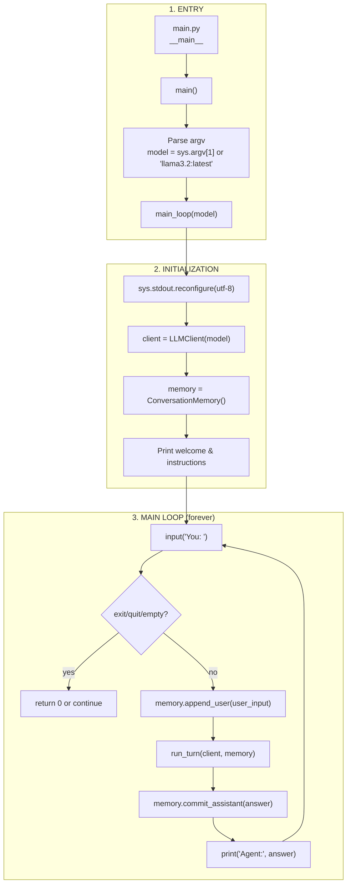
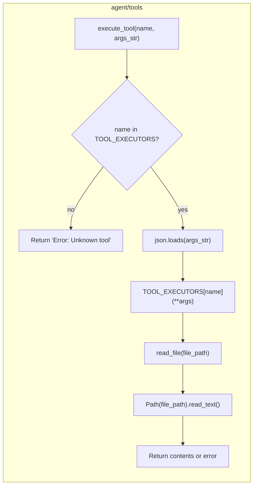
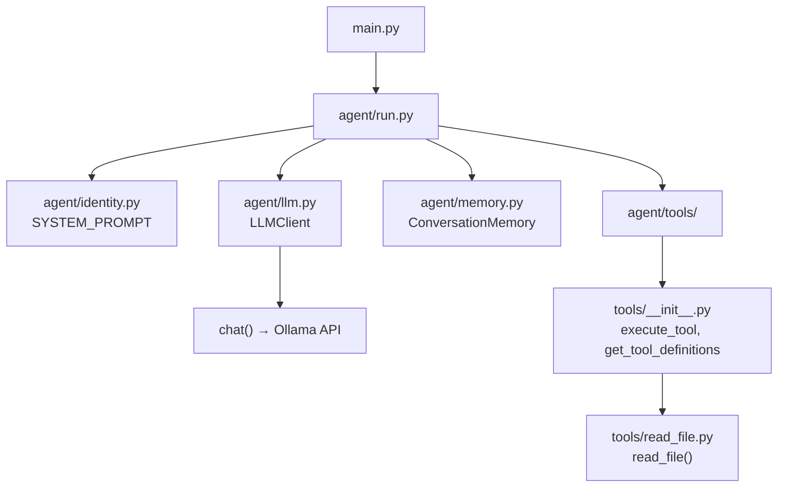

# Execution Mind Map — Local AI Agent

A visual map of how your code executes from start to finish.

---

## High-Level Flow (Mermaid)

---

## Detailed Turn Flow (run_turn)

```mermaid
flowchart TB
    subgraph TURN["run_turn(client, memory)"]
        T0["max_tool_rounds = 5\ntool_round = 0"]
        T0 --> T1["WHILE tool_round < 5"]
        
        T1 --> T2["client.chat(\n  messages=memory.get_messages(),\n  system=SYSTEM_PROMPT,\n  tools=get_tool_definitions())"]
        
        T2 --> T3["LLMClient.chat()"]
        T3 --> T4["Prepend system prompt to messages"]
        T4 --> T5["chat() → HTTP POST to Ollama\nlocalhost:11434/api/chat"]
        
        T5 --> T6["Parse response:\nmsg, content, tool_calls"]
        T6 --> T7["memory.append_assistant(msg)"]
        
        T7 --> T8{"tool_calls empty?"}
        T8 -->|yes| T9["RETURN content (final answer)"]
        T8 -->|no| T10["FOR each tool_call"]
        
        T10 --> T11["execute_tool(name, args_str)"]
        T11 --> T12["memory.append_tool_result(call_id, name, result)"]
        T12 --> T13["tool_round += 1"]
        T13 --> T1
    end
```

---

## Tool Execution Flow

---

## Module Dependency Graph

---

## Execution Checklist (Order of Operations)

| Step | Module | Action |
|------|--------|--------|
| 1 | `main.py` | `__main__` → `main()` |
| 2 | `main.py` | Parse `sys.argv` for model name |
| 3 | `agent/run.py` | `main_loop(model)` starts |
| 4 | `agent/run.py` | Create `LLMClient(model)` |
| 5 | `agent/run.py` | Create `ConversationMemory()` |
| 6 | `agent/run.py` | Print welcome, enter `while True` |
| 7 | `agent/run.py` | `input("You: ")` — wait for user |
| 8 | `agent/run.py` | Check exit/quit/empty |
| 9 | `agent/memory.py` | `memory.append_user(user_input)` |
| 10 | `agent/run.py` | Call `run_turn(client, memory)` |
| 11 | `agent/run.py` | Inside `run_turn`: `client.chat(...)` |
| 12 | `agent/llm.py` | `LLMClient.chat()` prepends system, calls `chat()` |
| 13 | `agent/llm.py` | `chat()` POSTs to Ollama, returns parsed JSON |
| 14 | `agent/run.py` | Parse `message`, `content`, `tool_calls` |
| 15 | `agent/memory.py` | `memory.append_assistant(msg)` |
| 16 | `agent/run.py` | If tool_calls: loop and `execute_tool()` |
| 17 | `agent/tools/` | `execute_tool()` → `read_file()` if requested |
| 18 | `agent/memory.py` | `memory.append_tool_result()` for each result |
| 19 | `agent/run.py` | Repeat tool round or return final content |
| 20 | `agent/run.py` | `memory.commit_assistant(answer)` |
| 21 | `agent/run.py` | `print("Agent:", answer)"` → back to step 7 |

---

*Generated from project codebase structure.*
