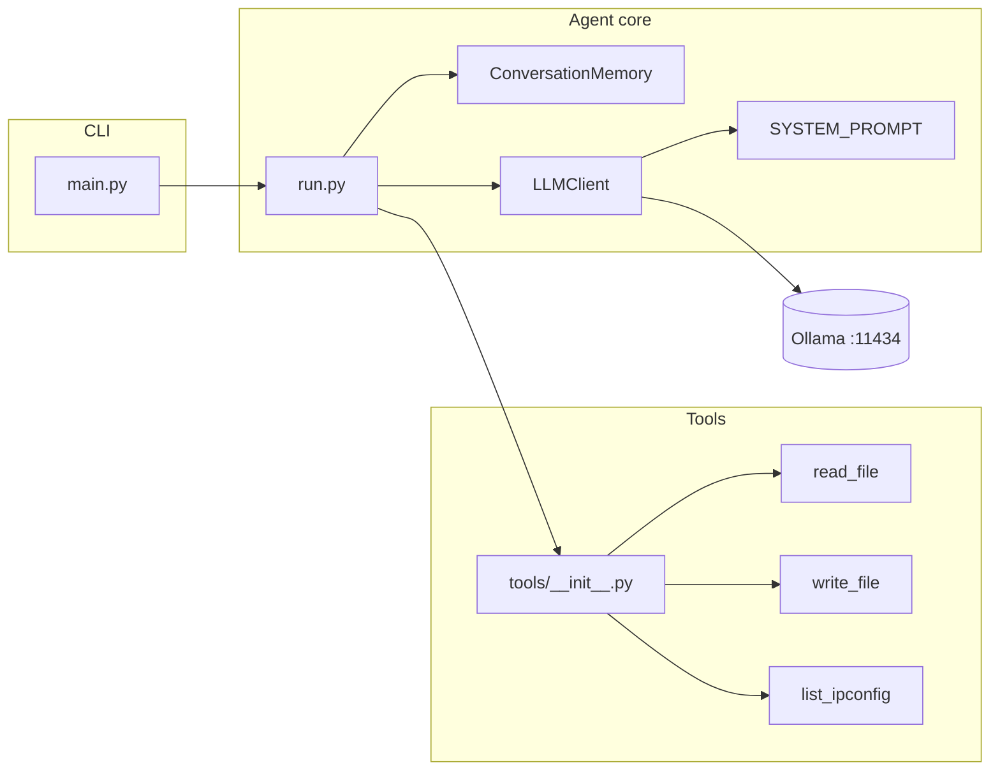

# MyFIRSTAgent

A **local-first** conversational agent: Python CLI, [Ollama](https://ollama.com/) for inference, and OpenAI-style **tool calling** over the filesystem and (on Windows) the network stack. No cloud APIs, no third-party Python packages—only the standard library.

---

## Why this exists

- **Privacy**: Prompts and file contents stay on the machine that runs Ollama.
- **Transparency**: Small, readable modules—identity, memory, LLM transport, tools, and the run loop are separated on purpose.
- **Extensibility**: New capabilities are added as tools (schema + executor) and registered in one place.

---

## Requirements

| Component | Notes |
|-----------|--------|
| **Python** | 3.10+ (uses `list[dict]` style typing and modern `pathlib` usage) |
| **Ollama** | Installed and reachable at `http://localhost:11434` (default chat API) |
| **Model** | One that supports **tool calling** for reliable tool use (e.g. Llama 3.1+, or other models Ollama exposes with `tool_calls`) |

There are **no PyPI dependencies**; transport uses `urllib` only.

---

## Quick start

1. **Install and start Ollama**, then pull a model (example):

   ```bash
   ollama pull llama3.2:latest
   ```

2. **Clone and run** (from the repository root):

   ```bash
   python main.py
   ```

   Optional first argument selects the Ollama model name:

   ```bash
   python main.py mistral:latest
   ```

3. **CLI commands**

   | Input | Behavior |
   |-------|----------|
   | Normal text | Appended as a user turn; the agent may call tools and reply. |
   | `exit` / `quit` | Ends the session. |
   | `/memory` | Prints the current conversation buffer as JSON **without** calling the model (debug/inspection). |

---

## Architecture

The design keeps **orchestration** (`run.py`), **state** (`memory.py`), **HTTP to Ollama** (`llm.py`), **persona** (`identity.py`), and **side effects** (`tools/`) in separate layers.



### Request flow (one user line)

1. The user message is appended to `ConversationMemory` as `{ "role": "user", "content": "..." }`.
2. `run_turn` calls `LLMClient.chat` with:
   - messages from memory,
   - **system** prompt from `identity.py`,
   - **tools** from `get_tool_definitions()` (OpenAI-compatible tool schemas).
3. If the model returns **`tool_calls`**, each call is executed via `execute_tool(name, arguments)`, and results are appended as `{ "role": "tool", "content": "...", "tool_call_id": "..." }`.
4. The loop repeats (up to **5** tool rounds) until the model returns a message **without** tool calls; that final text is shown to the user.

The system prompt is **not** stored in memory; it is prepended per request inside `LLMClient.chat`.

### Repository layout

```
.
├── main.py                 # Entry: delegates to agent.run.main_loop
├── agent/
│   ├── identity.py         # Agent name + SYSTEM_PROMPT
│   ├── llm.py              # Ollama /api/chat client (urllib)
│   ├── memory.py           # Message list + format_for_display + rollback
│   ├── run.py              # run_turn + interactive loop
│   └── tools/
│       ├── __init__.py     # TOOL_DEFINITIONS, TOOL_EXECUTORS, execute_tool
│       ├── read_file.py
│       ├── write_file.py
│       └── ipconfig.py     # Windows: cmd /c ipconfig
├── OLLAMA_API.md           # Ollama API notes (reference)
├── EXECUTION_MINDMAP.md    # Execution notes
└── Archive/
    └── chatbot.py          # Legacy tool-less chat (historical)
```

---

## Tools

Tools are defined as:

1. A **schema** dict (`*_DEFINITION`) in OpenAI tool format (`type`, `function.name`, `function.description`, `function.parameters`).
2. A **Python callable** with the same parameter names as in the schema.

Registration is centralized in `agent/tools/__init__.py` (`TOOL_DEFINITIONS` + `TOOL_EXECUTORS`).

| Tool | Purpose |
|------|---------|
| `read_file` | Read a UTF-8 file (with replacement on decode errors); returns text or an error string. |
| `write_file` | Write UTF-8 text; creates parent directories; overwrites if the path exists. |
| `list_ipconfig` | **Windows only**: runs `cmd /c ipconfig`, returns stdout/stderr (bounded timeout). |

To add a tool: implement the pair in a new module, import it in `__init__.py`, and append to both registry structures. No change to the run loop is required beyond what is already generic.

---

## Memory model

`ConversationMemory` holds a **flat list** of API-shaped dicts: `user`, `assistant` (possibly including `tool_calls`), and `tool` results. This list is exactly what is sent back to Ollama on the next turn (except the system prompt, injected by `LLMClient`).

Use `/memory` in the CLI to dump a JSON snapshot for debugging.

---

## Configuration

| Setting | Location | Default |
|---------|-----------|---------|
| Ollama chat URL | `agent/llm.py` → `OLLAMA_CHAT_URL` | `http://localhost:11434/api/chat` |
| Request timeout | `agent/llm.py` → `DEFAULT_TIMEOUT` | `120` seconds |
| Default model | `agent/llm.py` → `DEFAULT_MODEL` / `main.py` argv | `llama3.2:latest` |
| Max tool rounds per user line | `agent/run.py` → `max_tool_rounds` | `5` |

To point at another host/port, change `OLLAMA_CHAT_URL` (or add env-based config in `llm.py` if you extend the project).

---

## Troubleshooting

| Symptom | What to check |
|---------|----------------|
| `Cannot connect to Ollama` | Ollama service running; port `11434` not blocked; URL matches your setup. |
| Model not found | `ollama list` / `ollama pull <name>`. |
| Tools never invoked | Use a model known for tool calling in Ollama; verify the model shows tool support in Ollama docs. |
| `list_ipconfig` errors | Tool is **Windows-only**; on Linux/macOS it returns an explicit platform error. |
| Encoding issues in the terminal | `run.py` reconfigures `stdout` to UTF-8 on supported platforms; legacy consoles may still limit display. |

---

## Security note

Tools run **as the same user** that runs `python main.py`. `write_file` can overwrite paths the process can write; `read_file` reads any path the process can read. Treat this as a **trusted-local** agent, not a hardened sandbox.

---

## License

Specify a license in the repository root (e.g. `LICENSE`) if you open-source this project; the README does not impose one.

---

## See also

- `OLLAMA_API.md` — Ollama HTTP API reference snippets.
- `EXECUTION_MINDMAP.md` — High-level execution map for the codebase.
